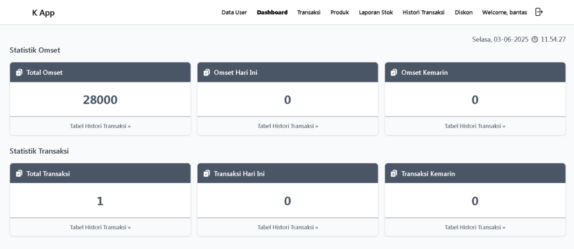
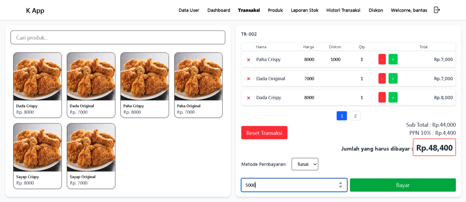
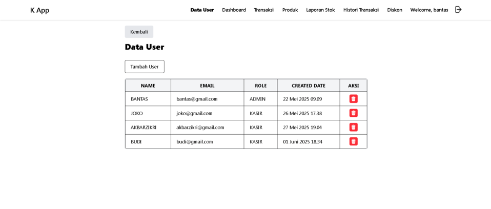
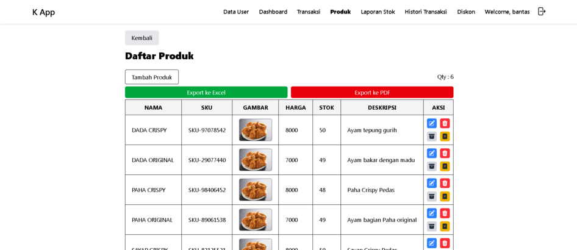
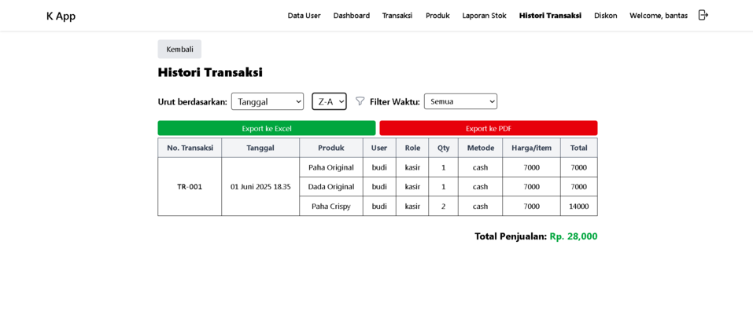
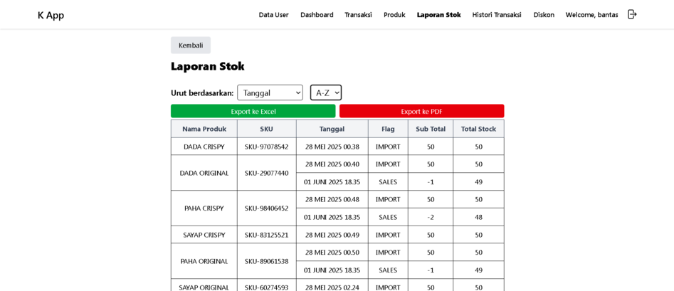
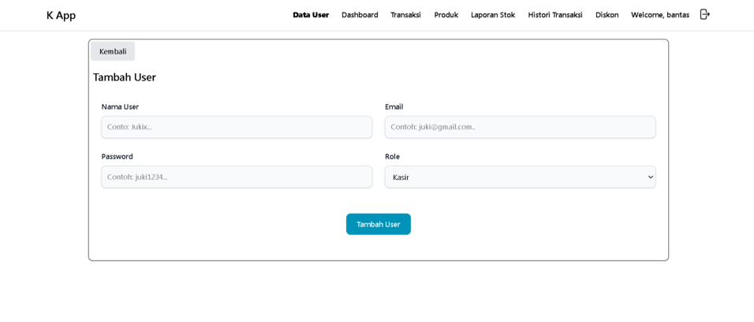
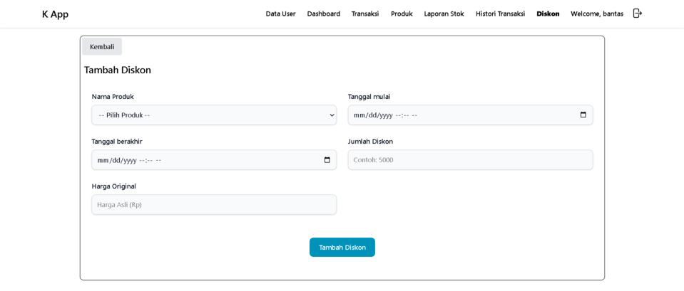
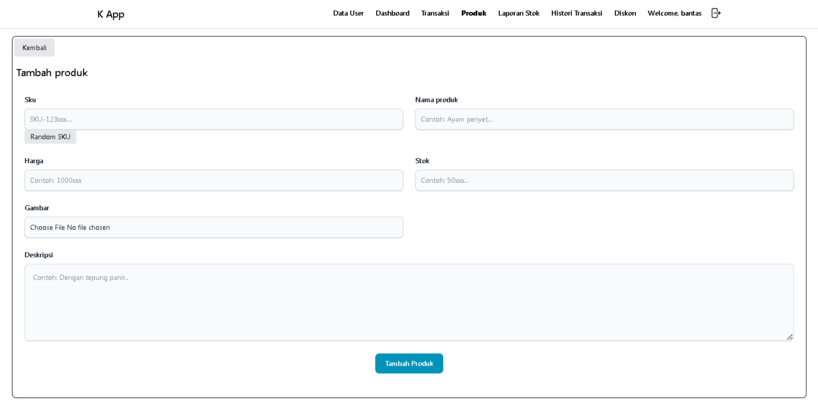
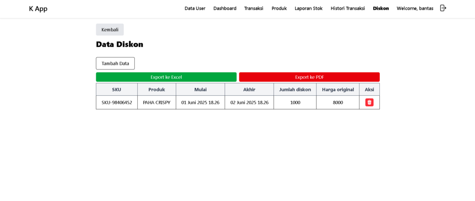

# Kaunto

**Kaunto** (diambil dari bahasa Jepang yang berarti "menghitung") adalah aplikasi kasir berbasis web yang dirancang untuk membantu perhitungan transaksi dan manajemen stok dengan cara yang sederhana dan efisien.

## 🚀 Fitur Utama

- ✅ Manajemen Produk (CRUD)
- ✅ Transaksi Penjualan
- ✅ Diskon Produk
- ✅ Kelola Pengguna
- ✅ Laporan Penjualan

## ⚙️ Teknologi yang Digunakan

- [Next.js](https://nextjs.org/)
- [Tailwind CSS](https://tailwindcss.com/)
- [MySQL](https://www.mysql.com/) (Database Lokal)

## 🛠️ Cara Instalasi

1. Clone repository ini:
   ```bash
   git clone https://github.com/username/kaunto.git
   cd kaunto
   Siapkan database MySQL lokal kamu, dan atur koneksi pada file .env.local.
   ```

Install dependencies:
npm install

Jalankan aplikasi:
npm run dev

📄 Lisensi
Aplikasi ini dikembangkan untuk tujuan pembelajaran dan penggunaan pribadi. Silakan modifikasi sesuai kebutuhan Anda.

---

## 📸 Preview Aplikasi












